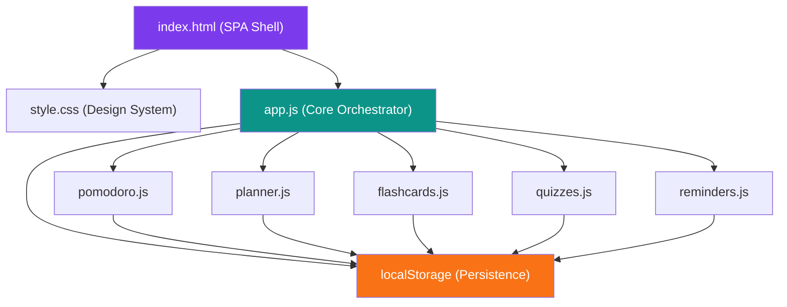
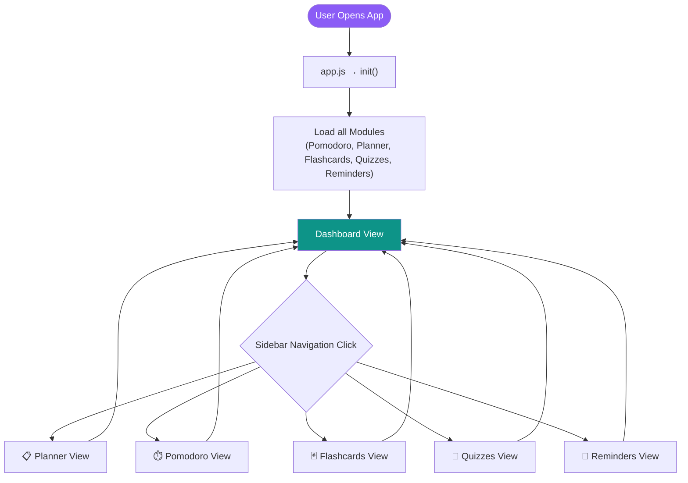
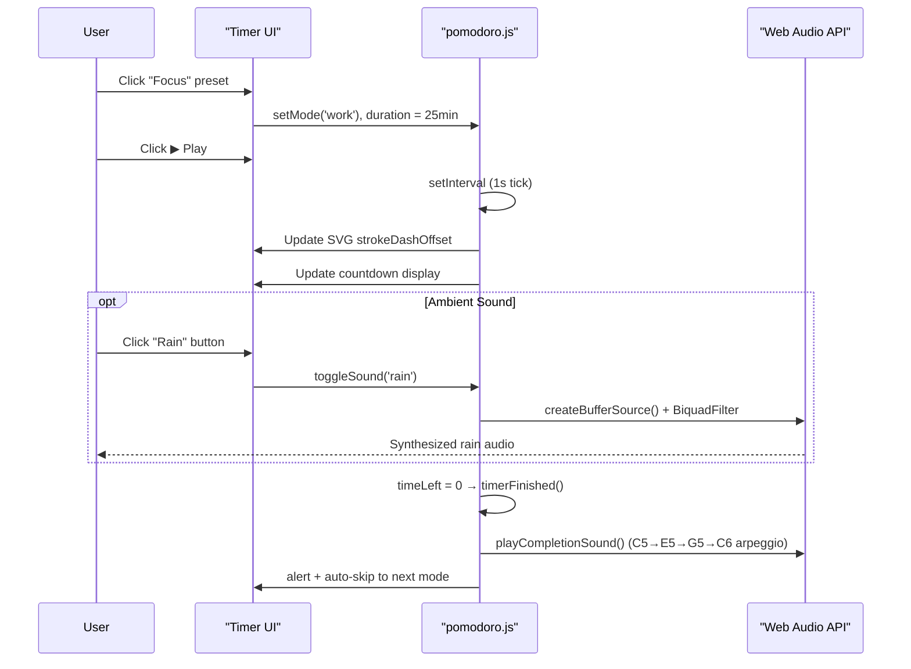
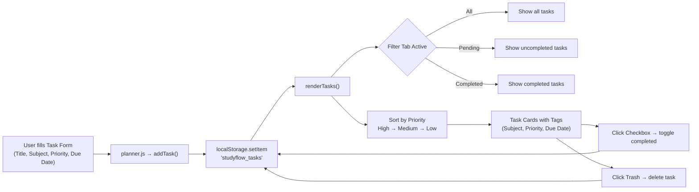
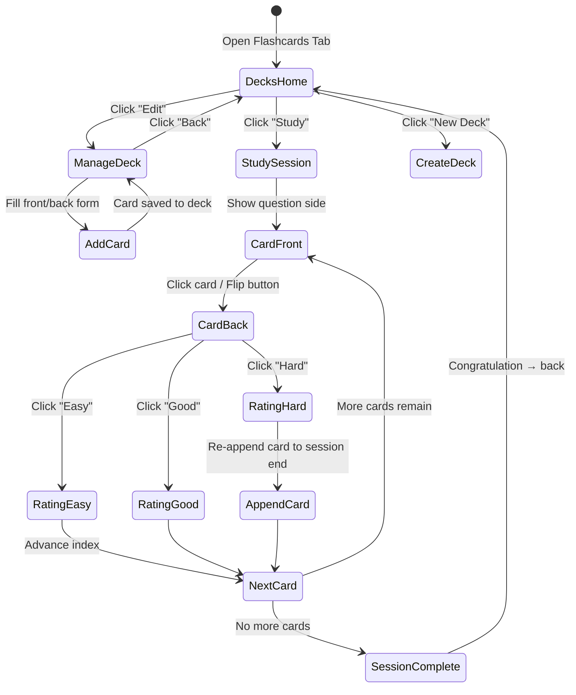
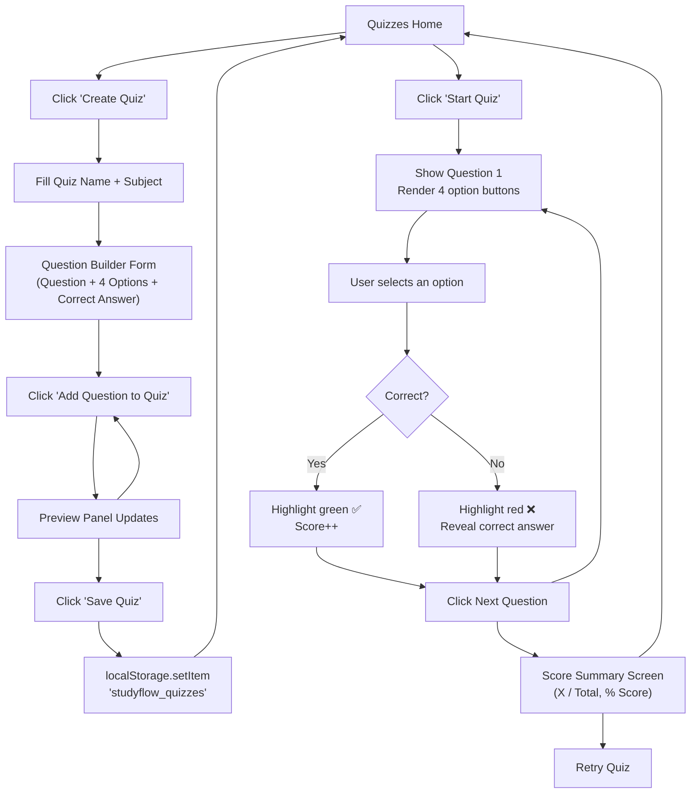
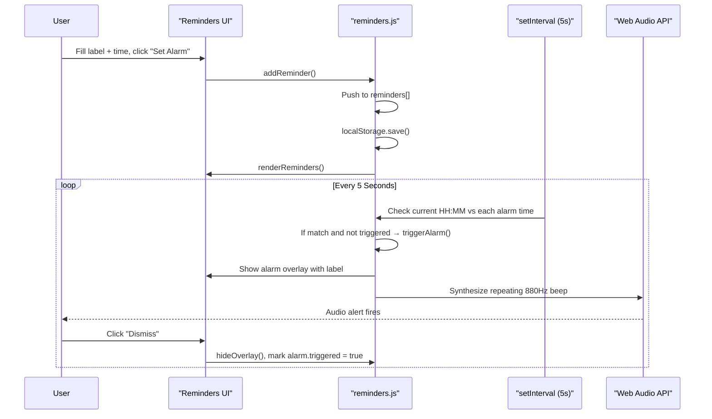
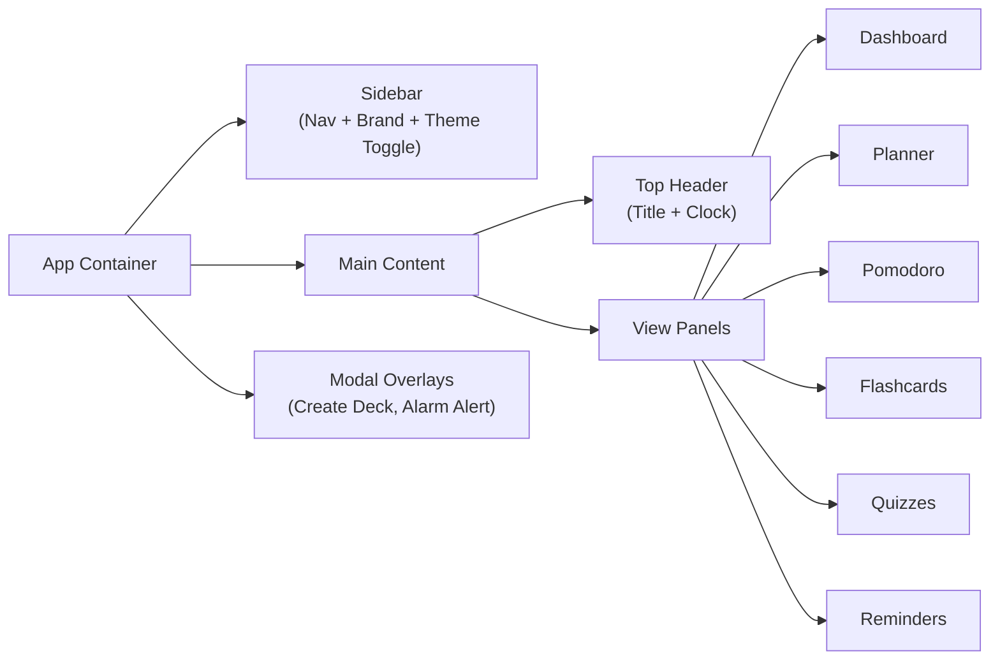

# 📚 StudyFlow — Ultimate Study Planner & Productivity Suite

> **StudyMentor** is a premium, fully client-side Single Page Application (SPA) built with **HTML5, Vanilla CSS, and JavaScript** — no build tools, no frameworks, no backend required. All data is persisted locally in your browser's `localStorage`.

[](LICENSE)
[](https://developer.mozilla.org/en-US/docs/Web/JavaScript)
[](#)

---

## ✨ Features at a Glance

| Feature | Description |
|---|---|
| 📊 **Dashboard** | Live clock, daily quotes, stats overview, task & alarm previews |
| ✅ **Study Planner** | Priority-tagged to-do list with categories and due dates |
| ⏱️ **Pomodoro Timer** | Circular SVG countdown with 3 modes + Web Audio API ambient sounds |
| 🃏 **Flashcards** | Deck-based 3D flip cards with spaced repetition self-assessment |
| 🧠 **Quiz Maker** | Create and play custom 10+ question multiple-choice quizzes |
| 🔔 **Reminders** | Custom alarm scheduler with synthesized beep alerts |

---

## 🗂️ Project Structure

```
studyflow/
├── index.html          # Main SPA shell — sidebar, views, modals
├── style.css           # Design system — CSS variables, glassmorphism, animations
├── app.js              # Core orchestrator — navigation, clock, stats, theme
└── js/
    ├── pomodoro.js     # Timer logic + Web Audio API soundscapes
    ├── planner.js      # Task CRUD + filter logic
    ├── flashcards.js   # Deck management + 3D card flip study sessions
    ├── quizzes.js      # Quiz builder + interactive play + scoring
    └── reminders.js    # Alarm scheduling + triggered notification system
```

---

## 🏗️ Architecture Overview



---

## 🔄 Application Navigation Flow



---

## ⏱️ Pomodoro Timer Workflow



---

## ✅ Task Planner Workflow



---

## 🃏 Flashcard System Workflow



---

## 🧠 Quiz Maker & Play Workflow



---

## 🔔 Reminder System Workflow



---

## 🎨 Design System

The app uses a **CSS custom properties design system** with full dark/light mode support:

```css
:root {
  --accent-purple:  #8b5cf6; /* Primary CTA, active nav */
  --accent-teal:    #14b8a6; /* Success, ambient sounds */
  --accent-orange:  #f97316; /* Long break, warnings */
  --accent-red:     #ef4444; /* Danger actions, errors */
  --bg-glass:       rgba(25, 28, 44, 0.45); /* Card backgrounds */
  --border-glass:   rgba(255, 255, 255, 0.07); /* Glassmorphism border */
}
```

### Component Hierarchy



---

## 🔊 Web Audio API Soundscapes

The Pomodoro module generates **4 synthetic ambient soundscapes** using the Web Audio API — no audio files needed, works 100% offline:

| Sound | Technique |
|---|---|
| 🌧️ **Rain** | Bandpass-filtered white noise + 5Hz LFO volume modulation |
| 🌊 **White Noise** | Lowpass-filtered white noise buffer at 8kHz |
| 🌊 **Ocean Waves** | Lowpass noise + ultra-slow 0.12Hz sine LFO (rise/fall) |
| ☕ **Cafe Buzz** | Low-frequency rumble + random synthetic clinking sounds every 4s |

---

## 💾 Data Persistence Model

All data is stored in `localStorage` under the following keys:

| Key | Module | Content |
|---|---|---|
| `studyflow_tasks` | Planner | Array of task objects |
| `studyflow_decks` | Flashcards | Array of deck objects with nested cards |
| `studyflow_quizzes` | Quizzes | Array of quiz objects with nested questions |
| `studyflow_reminders` | Reminders | Array of reminder objects |
| `studyflow_focus_mins` | Pomodoro | Total focus minutes logged |
| `studyflow_quizzes_taken` | Quizzes | Count of quiz sessions played |
| `studyflow_theme` | App | `'dark'` or `'light'` |
| `studyflow_cfg_work` | Pomodoro | Focus duration (minutes) |
| `studyflow_cfg_short` | Pomodoro | Short break duration |
| `studyflow_cfg_long` | Pomodoro | Long break duration |

---

## 🚀 Getting Started

### Prerequisites
- A modern web browser (Chrome, Edge, Firefox, Safari)
- No Node.js, no npm, no build step required!

### Run Locally
```bash
# Clone the repository
git clone https://github.com/hemangi8/studymentor.git

# Navigate to the folder
cd studymentor

# Open index.html in your browser
# Windows:
start index.html

# macOS:
open index.html

# Linux:
xdg-open index.html
```

That's it! The app runs completely in the browser with no server needed.

---

## 📖 User Guide

### 1. Dashboard
- View your **Focus Time**, **Tasks Completed**, and **Quizzes Taken** at a glance.
- See your top pending tasks and upcoming alarms.
- Toggle **Dark / Light Mode** from the sidebar footer.

### 2. Study Planner (To-Do)
- Fill in the task form (title, subject, priority, due date) and click **Add Task**.
- Use the filter tabs — **All / Pending / Completed** — to sort your list.
- Click the **checkbox** to mark tasks done, the **trash icon** to delete.
- Use **Clear Completed** to bulk-remove done tasks.

### 3. Pomodoro Timer
- Choose a preset: **Focus (25 min)**, **Short Break (5 min)**, or **Long Break (15 min)**.
- Customize durations in the **Timer Configuration** panel on the right.
- Click a sound button to start an ambient soundscape, adjust volume with the slider.
- Press ▶ to start, ⏸ to pause, ↺ to reset, ⏭ to skip modes.

### 4. Flashcards
- Click **New Deck** to create a flashcard deck.
- Open a deck with **Edit** to add front/back card pairs.
- Click **Study** to enter the flipping session.
  - Click the card or the **Flip Card** button to reveal the answer.
  - Rate yourself: **Hard** (re-added to session), **Good**, or **Easy**.

### 5. Quiz Maker
- Click **Create Quiz**, enter a name and subject.
- Build questions: type the question, fill 4 options, select the correct one.
- Click **Add Question to Quiz** for each question (build as many as you want).
- Click **Save Quiz** when done.
- Back on the home screen, click **Start Quiz** to play.
- Select answers and use **Next Question** to progress.
- View your score and percentage on the **Summary Screen**.

### 6. Reminders
- Enter an alarm label and time (HH:MM format).
- Click **Set Alarm**. The app checks every 5 seconds.
- When an alarm fires, an animated overlay appears with a repeating audio alert.
- Click **Dismiss Alarm** to close it.

---

## 🛠️ Technology Stack

| Technology | Usage |
|---|---|
| **HTML5** | Semantic structure, modals, forms |
| **CSS3** | Glassmorphism, CSS Variables, Keyframes, Grid/Flexbox |
| **Vanilla JavaScript** | Module pattern (IIFE), DOM manipulation, event handling |
| **Web Audio API** | Synthetic ambient sounds, alarm beeps, completion chimes |
| **localStorage API** | Client-side data persistence |
| **Lucide Icons** | Icon library (CDN) |
| **Google Fonts** | Inter + Outfit typefaces |

---

## 🤝 Contributing

1. Fork the repo
2. Create a feature branch: `git checkout -b feat/your-feature`
3. Commit changes: `git commit -m "feat: add your feature"`
4. Push to your branch: `git push origin feat/your-feature`
5. Open a Pull Request

---

## 📜 License

This project is licensed under the **MIT License** — see [LICENSE](LICENSE) for details.

---

## 👩‍💻 Author

**Hemangi Patil**  
📧 hemangipatil9423@gmail.com  
🐙 [@hemangi8](https://github.com/hemangi8)

---

> *Built with ❤️ as a premium study productivity tool. No frameworks. No dependencies. Just pure web fundamentals.*
